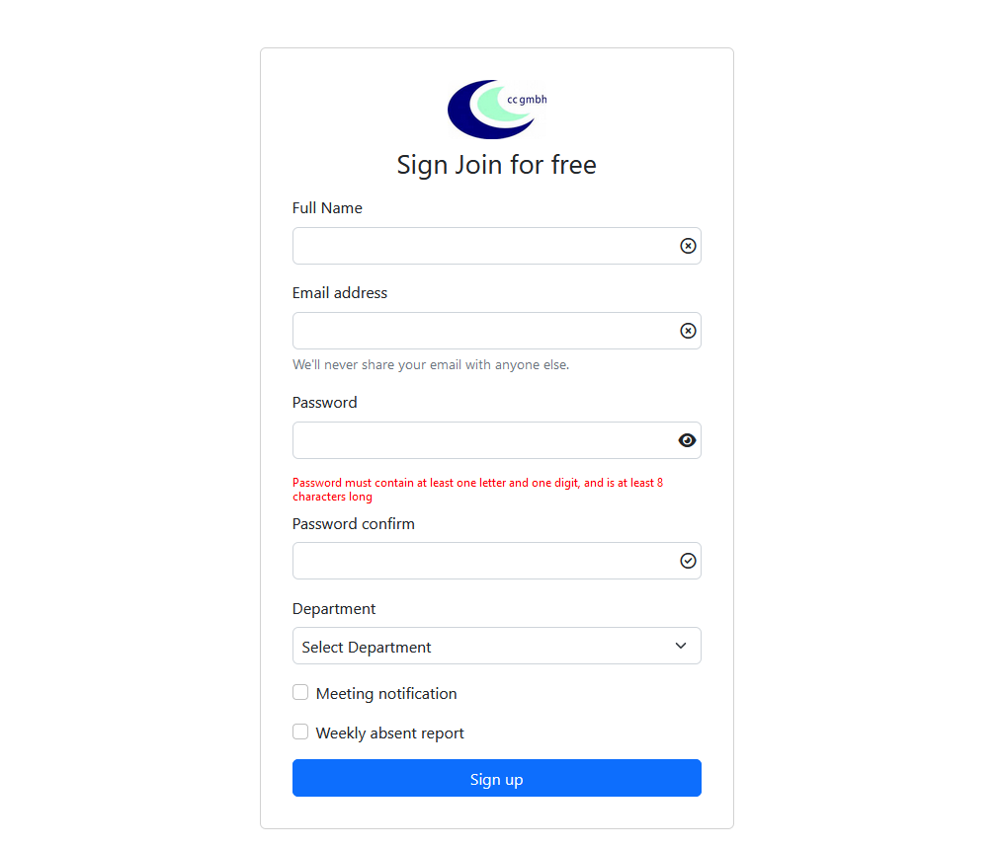

### Flash card app using Vue.js

This is the initial project. I have here simple html file , style.css file and data.js as json file.

### What i have done here.

1. Add data.js file in html file
2. Add vue.js in our app using CDN

if you run this app using live server you will see very simple page.

#### Connect with me

 
 

